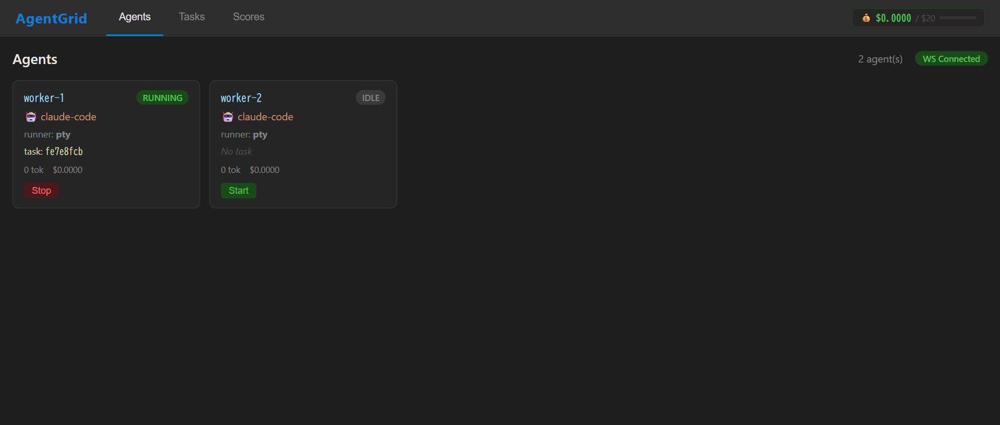
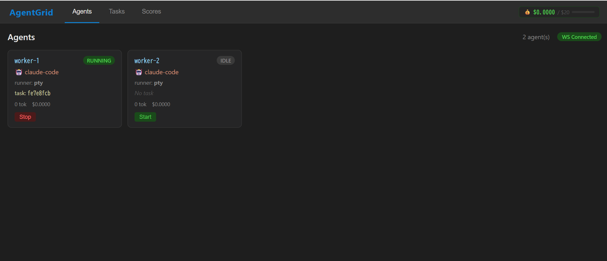
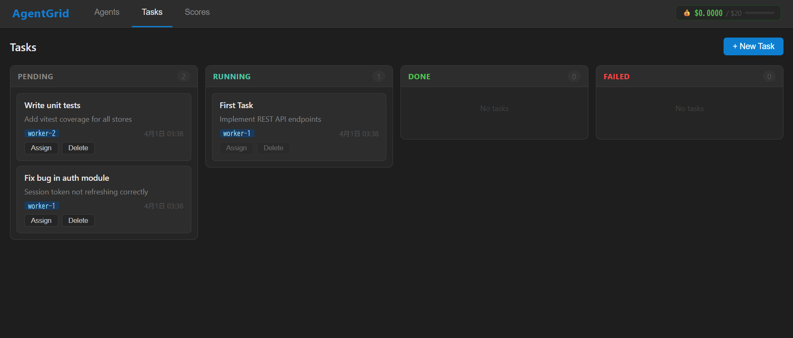
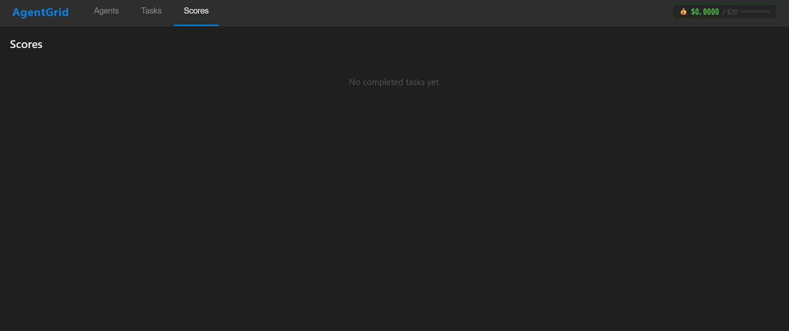

# AgentGrid

A unified management dashboard for launching multiple AI coding agents (Claude Code / Gemini CLI / Codex) in parallel and dividing tasks among them.



---

## Overview

```
[AgentGrid Dashboard] ← Monitor and control agents via Web UI
        ↓ WebSocket
[Orchestrator Server] ← Task distribution, lock management, log aggregation
        ↓ PTY / SDK
[Worker Agents ×N]   ← Claude Code / Gemini CLI / Codex write code in parallel
        ↓
[Judge Agent]         ← Scores completed code and returns results
```

### Key Features

| Feature | Description |
|---|---|
| **Kanban Task Board** | Manage tasks across Pending / Running / Done / Failed columns |
| **Agent Grid** | Real-time display of all agents' status, cost, and logs |
| **Score Card** | Automated scoring by Judge Agent (completion, quality, security, UX, tests) |
| **Cost Meter** | Cumulative API cost shown in header at all times, with alerts on threshold breach |
| **WebSocket Sync** | Real-time broadcast of agent state changes to all connected clients |
| **Git Worktree Isolation** | Automatically creates an independent working branch per agent |

---

## Screenshots

### Agents Tab



### Tasks Tab



### Scores Tab



---

## Requirements

| Requirement | Version |
|---|---|
| Node.js | 18.0.0 or later (recommended: 22 LTS) |
| npm | 9.0.0 or later |
| Git | 2.20.0 or later (worktree feature required) |
| OS | macOS / Linux / Windows 11 |

### Agent Installation (install only what you need)

```bash
# Claude Code
npm install -g @anthropic-ai/claude-code

# Gemini CLI
npm install -g @google/gemini-cli

# OpenAI Codex
npm install -g @openai/codex
```

---

## Installation

```bash
npm install -g agentgrid
```

Or build from the repository:

```bash
git clone https://github.com/Koki-K-Aj/agentgrid.git
cd agentgrid
npm install
npm run build
```

---

## Quick Start

### 1. Initialize in your project

```bash
cd /path/to/your/project
agentgrid init
```

This generates `agentgrid.config.json`.

### 2. Start

```bash
agentgrid start
```

Open `http://localhost:3000` in your browser to see the dashboard.

### 3. Add agents

Register agents via the dashboard REST API or in the config file.

```bash
# Add via REST API
curl -X POST http://localhost:3000/api/agents \
  -H "Content-Type: application/json" \
  -d '{"id": "worker-1", "type": "claude-code", "runner": "pty"}'
```

### 4. Create and assign tasks

Create tasks via the dashboard's "+ New Task" button or the API.

```bash
# Create a task
curl -X POST http://localhost:3000/api/tasks \
  -H "Content-Type: application/json" \
  -d '{"title": "Implement auth module", "description": "Implement JWT authentication"}'

# Assign to an agent
curl -X POST http://localhost:3000/api/tasks/{taskId}/assign \
  -H "Content-Type: application/json" \
  -d '{"agentId": "worker-1"}'
```

---

## Configuration

Place `agentgrid.config.json` in the project root.

```json
{
  "runner": "pty",
  "maxAgents": 10,
  "repo": "./",
  "agents": [
    {
      "id": "worker-1",
      "type": "claude-code",
      "runner": "pty"
    },
    {
      "id": "worker-2",
      "type": "gemini-cli",
      "runner": "pty"
    }
  ],
  "judge": {
    "enabled": true,
    "type": "claude-code",
    "runner": "sdk",
    "scoreItems": ["completion", "quality", "security", "ux", "tests"]
  },
  "cost": {
    "alertThreshold": 18.0,
    "stopThreshold": 20.0,
    "currency": "USD"
  }
}
```

### Configuration Reference

#### Root

| Key | Type | Default | Description |
|---|---|---|---|
| `runner` | `"pty"` \| `"sdk"` | `"pty"` | Agent execution mode |
| `maxAgents` | number | `10` | Maximum number of agents running simultaneously |
| `repo` | string | `"./"` | Path to the target repository |

#### cost

| Key | Type | Default | Description |
|---|---|---|---|
| `alertThreshold` | number | `18.0` | Show a warning banner when this amount (USD) is exceeded |
| `stopThreshold` | number | `20.0` | Show a stop alert when this amount (USD) is reached |
| `currency` | string | `"USD"` | Display currency (currently USD only) |

#### judge

| Key | Type | Description |
|---|---|---|
| `enabled` | boolean | Enable automated scoring by the Judge Agent |
| `type` | string | Agent type to use as Judge |
| `scoreItems` | string[] | Scoring dimensions to evaluate |

---

## Supported Agents

| Agent | `type` value | Required command | Description |
|---|---|---|---|
| **Claude Code** | `"claude-code"` | `claude` | Anthropic's AI coding agent |
| **Gemini CLI** | `"gemini-cli"` | `gemini` | Google's AI coding agent |
| **OpenAI Codex** | `"codex"` | `codex` | OpenAI's AI coding agent |

---

## REST API Reference

### Tasks

| Method | Path | Description |
|---|---|---|
| `GET` | `/api/tasks` | List all tasks |
| `POST` | `/api/tasks` | Create a task |
| `PATCH` | `/api/tasks/:id` | Update a task |
| `DELETE` | `/api/tasks/:id` | Delete a task |
| `POST` | `/api/tasks/:id/assign` | Assign to an agent |

### Agents

| Method | Path | Description |
|---|---|---|
| `GET` | `/api/agents` | List all agents |
| `POST` | `/api/agents` | Register an agent |
| `POST` | `/api/agents/:id/start` | Start an agent |
| `POST` | `/api/agents/:id/stop` | Stop an agent |
| `POST` | `/api/agents/:id/message` | Send a message to an agent |
| `GET` | `/api/agents/:id/logs` | Retrieve logs |
| `DELETE` | `/api/agents/:id` | Delete an agent |

### Metrics

| Method | Path | Description |
|---|---|---|
| `GET` | `/api/metrics/cost` | Aggregated cost (including thresholds) |
| `GET` | `/api/scores/:taskId` | Scores for a task |

---

## Architecture

```
agentgrid/
├── packages/
│   ├── orchestrator/          # Node.js + Express server
│   │   └── src/
│   │       ├── api/           # REST API endpoints
│   │       ├── runners/       # AgentRunner abstract class + PTYRunner
│   │       ├── services/      # LockManager, WorktreeManager, JudgeAgent
│   │       ├── store/         # SQLite (better-sqlite3)
│   │       └── ws/            # WebSocket server
│   └── dashboard/             # Vue 3 + Vite frontend
│       └── src/
│           ├── components/    # AgentGrid, TaskBoard, ScoreCard, CostMeter
│           ├── stores/        # Pinia (agents, tasks, metrics)
│           └── composables/   # useWebSocket
├── .agentgrid/
│   ├── locks/                 # Task lock files
│   ├── logs/                  # Agent logs
│   └── worktrees/             # git worktrees
└── agentgrid.config.json
```

### Tech Stack

| Layer | Technology |
|---|---|
| Frontend | Vue 3 + Vite + Pinia |
| Backend | Node.js + Express 5 + TypeScript |
| Database | SQLite (better-sqlite3) |
| Real-time | WebSocket (ws) |
| Process management | node-pty (spawn agents via PTY) |
| Testing | Vitest + @vue/test-utils |

---

## Development

```bash
# Install dependencies
npm install

# Start dev servers (Orchestrator + Dashboard)
npm run dev

# Run tests
npm test --workspaces

# Build
npm run build
```

---

## License

MIT License

Copyright (c) 2026 AgentGrid Contributors

Permission is hereby granted, free of charge, to any person obtaining a copy
of this software and associated documentation files (the "Software"), to deal
in the Software without restriction, including without limitation the rights
to use, copy, modify, merge, publish, distribute, sublicense, and/or sell
copies of the Software, and to permit persons to whom the Software is
furnished to do so, subject to the following conditions:

The above copyright notice and this permission notice shall be included in all
copies or substantial portions of the Software.

THE SOFTWARE IS PROVIDED "AS IS", WITHOUT WARRANTY OF ANY KIND, EXPRESS OR
IMPLIED, INCLUDING BUT NOT LIMITED TO THE WARRANTIES OF MERCHANTABILITY,
FITNESS FOR A PARTICULAR PURPOSE AND NONINFRINGEMENT. IN NO EVENT SHALL THE
AUTHORS OR COPYRIGHT HOLDERS BE LIABLE FOR ANY CLAIM, DAMAGES OR OTHER
LIABILITY, WHETHER IN AN ACTION OF CONTRACT, TORT OR OTHERWISE, ARISING FROM,
OUT OF OR IN CONNECTION WITH THE SOFTWARE OR THE USE OR OTHER DEALINGS IN THE
SOFTWARE.
